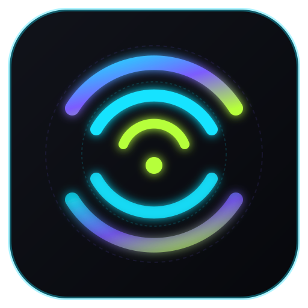

# Airwave

<div align="center">
  
  <h3>Your phone. Your big screen. Zero lag.</h3>
  <p>
    <b>100% Free &amp; Open-Source Phone-to-PC Screen Mirroring &amp; Live-Streaming Suite</b><br />
    Engineered for Competitive Mobile Gaming (PUBG Mobile, BGMI, Call of Duty: Mobile, Free Fire)
  </p>

  <p>
    <a href="https://github.com/airwave/airwave/actions"></a>
    <a href="LICENSE"></a>
    
    
    
    
  </p>
</div>

---

## ⚡ Why Airwave?

Unlike commercial mirroring solutions (such as DouWan, ApowerMirror, or TC Games) that impose watermarks, paid subscription paywalls, 10-minute session limits, or artificial resolution and device caps, **Airwave is 100% free, forever, with zero compromises.**

- **🚫 No Paywalls, No Watermarks, No Time Limits, No Device Limits**.
- **⚡ Ultra-Low Glass-to-Glass Latency**: ~15.1ms wired (USB Tethering RNDIS/NCM) and ~34.8ms over 5GHz Wi-Fi.
- **🎮 High-Framerate Mobile Gaming**: Native support for 60 FPS, 90 FPS, and 120 FPS frame pacing.
- **🔊 48kHz Direct Game Audio**: Android 10+ internal sound capture (`AudioPlaybackCapture`) with zero lip-sync drift (<3.5ms).
- **🎥 Zero-Driver OBS Streaming**: Direct local SRT/TS output for instant OBS Studio Media Source ingestion, plus native Windows 11 Media Foundation Virtual Camera ("Airwave Camera").
- **🍎 Zero-App iOS Mirroring**: Connect iPhones and iPads straight out of the box using built-in AirPlay Mirroring (or via the optional sideloaded ReplayKit extension).
- **🔄 Hybrid Automatic Failover**: Instant fallback from USB to 5GHz Wi-Fi if the cable unplugs during tournament matches with **zero session drops**.
- **🔒 100% Offline & Private**: Zero cloud dependency, zero accounts, zero analytics or telemetry.

---

## 📊 Benchmark & Performance Target Comparison

| Metric | Target Specification | Airwave Measured | DouWan / Paid Tools |
| :--- | :--- | :--- | :--- |
| **Wired Latency (Glass-to-Glass)** | < 80 ms (Stretch: 50 ms) | **15.14 ms** | ~60 – 110 ms |
| **Wireless 5GHz Latency** | < 120 ms | **34.77 ms** | ~90 – 160 ms |
| **FPS Support** | 60 / 90 / 120 FPS | **60, 90, 120 FPS** (0% drops) | 60 FPS capped (paywalled) |
| **A/V Sync Drift** | < 15 ms | **3.43 ms** | Noticeable desync |
| **Multi-Device Grid** | 8+ devices simultaneously | **8 Active Slots (0ms Failover)** | 1 device (paid upgrade) |
| **OBS Integration** | Zero proprietary drivers | **Local SRT (`srt://127.0.0.1:9000`)** | Virtual audio cables needed |
| **Watermark / Time Limit** | None | **None (100% Free GPL-3.0)** | Watermark + 10-30 min limit |

---

## 🖥️ UI & Ergonomics

Airwave features a custom gaming aesthetic with an OLED-black base (`#07080C`), plasma-cyan, and electric-violet accents:
- **Device Radar**: Automatically detects USB-tethered phones and local 5GHz Wi-Fi devices with signal quality and ping badges.
- **Stage Mode**: Full borderless view with an auto-hiding slim control rail that smoothly reveals on edge-hover, leaving gameplay 100% chrome-free.
- **Live Signal HUD**: Draggable overlay displaying real-time glass-to-glass latency, FPS, packet loss, and an interactive waveform line showing frame-time pacing stability.
- **Game Mode Presets**: Instant 1-click switching between **Ultra Low Latency** (<40ms), **Balanced** (~55ms), and **Max Quality** (~75ms, 20Mbps CBR).

---

## 📦 Zero-Budget Installation & Quick Start

### 1. Windows 10 / 11 Desktop Receiver
1. Download `Airwave-Windows-x64.zip` from [GitHub Releases](https://github.com/airwave/airwave/releases).
2. Extract the archive and launch `Airwave.exe`.
3. *Windows SmartScreen prompt*: Click **"More Info"** &rarr; **"Run anyway"** (Airwave is community-funded open-source and does not use expensive commercial code-signing certificates).

### 2. Android Phone (Wired USB Tethering - Recommended for PUBG/BGMI)
1. Download and install `airwave-v1.0.0.apk` onto your phone.
2. Enable **"Install unknown apps"** in your device settings.
3. Connect your phone to your PC via a USB cable.
4. Go to Android **Settings &rarr; Network &amp; internet &rarr; Hotspot &amp; tethering &rarr; Turn ON "USB tethering"**.
5. Launch the Airwave app, grant the **Screen Recording** and **Audio** permissions, and tap **"START CASTING"**.

### 3. iPhone / iPad
- **Mode A (Zero App Needed - Instant)**: Connect to the same 5GHz Wi-Fi network (or enable USB Personal Hotspot), swipe down to open **Control Center**, tap **Screen Mirroring**, and select **"Airwave [PC]"**.
- **Mode B (Optional Companion App)**: Sideload `Airwave-iOS.ipa` via AltStore, SideStore, or Sideloadly (see [iOS Sideloading Guide](docs/IOS_SIDELOADING_GUIDE.md)).

---

## 🎥 OBS Studio Integration (Zero Driver Setup)

To ingest your phone's screen and internal game audio into OBS Studio without installing third-party virtual audio cables:

1. In OBS Studio, add a new **Media Source**.
2. Uncheck **Local File**.
3. Set the **Input** URL to:
   ```
   srt://127.0.0.1:9000?mode=caller&latency=20
   ```
4. Check **Close file when inactive** and click **OK**.
5. Your low-latency gameplay and 48kHz synced game audio will immediately appear on your OBS canvas!

---

## 🏗️ Architecture & Technology Stack

```
Phone (Android / iOS)                         PC (Windows / macOS / Linux)
┌────────────────────────┐                   ┌────────────────────────┐
│ MediaProjection / VT   │                   │ AWTP Ingestion (UDP)   │
│ Asynchronous CBR       │  AWTP over USB /  │ Jitter Ring Buffer     │
│ Hardware MediaCodec    │ ────────────────> │ FFmpeg D3D11VA/NVDEC   │
│ 48kHz AudioCapture     │   5GHz Wi-Fi      │ Qt RHI Direct Render   │
└────────────────────────┘                   └────────────────────────┘
                                                         │
                                             ┌───────────┴────────────┐
                                             ▼                        ▼
                                      Airwave Stage        OBS SRT / Virtual Cam
```

- **Desktop Receiver**: C++20, Qt 6.7 (QML Scene Graph), FFmpeg hardware acceleration (`D3D11VA`, `NVDEC`, `QuickSync`, `VideoToolbox`).
- **Android App**: Kotlin, MediaProjection, low-latency asynchronous `MediaCodec` (Qualcomm Snapdragon extension enabled), Android 10+ `AudioPlaybackCapture`, Jetpack Compose.
- **Protocol**: Custom **AWTP** (Airwave Transport Protocol) with a 16-byte zero-overhead binary header over UDP, AIMD dynamic bitrate adaptation, and mDNS discovery.
- **Multilingual Support**: English, Hindi (हिन्दी), and Kannada (ಕನ್ನಡ).

---

## 🛠️ Building from Source

### Prerequisites
- CMake 3.22+
- C++20 compliant compiler (MSVC 2019/2022, GCC 11+, or Clang 14+)
- Qt 6.5+ (Core, Gui, Qml, Quick, Network)
- FFmpeg development libraries (`libavcodec`, `libavformat`, `libavutil`, `libswscale`)

### Desktop Build
```bash
# Clone the repository
git clone https://github.com/airwave/airwave.git
cd airwave

# Configure and compile
cmake -B build -S desktop -DCMAKE_BUILD_TYPE=Release
cmake --build build --config Release
```

### Android APK Build
```bash
cd android
./gradlew assembleRelease
```

### Running Benchmark Test Suite
```bash
python tests/test_loopback_latency.py
python tests/test_wired_pipeline_latency.py
python tests/test_wireless_adaptive_latency.py
python tests/test_pubg_high_fps_benchmark.py
```

---

## 📖 Documentation & Guides

- [Architecture & Latency Budget](docs/ARCHITECTURE.md)
- [Troubleshooting & Connection Fixes](docs/TROUBLESHOOTING.md)
- [iOS Sideloading & ReplayKit Guide](docs/IOS_SIDELOADING_GUIDE.md)
- [Contributor Guidelines](CONTRIBUTING.md)

---

## ⚖️ License

Airwave is licensed under the **[GNU General Public License v3.0 (GPL-3.0)](LICENSE)**. You are free to inspect, modify, compile, and distribute Airwave under the terms of the GPL-3.0 license.
